<!--more-->

优先级队列！

刻意练习！练习缺点，弱点的地方。跳出舒适区。

机会总是留给有准备的人！

## P1-5 基础介绍

#### 常用数据结构


 


```python
def quick_sort(lst):
    if not lst:
        return []
    if len(lst)<2:
        return lst
    pivot = lst[0]
    left = quick_sort([x for x in lst[1: ] if x < pivot])
    right = quick_sort([x for x in lst[1: ] if x >= pivot])
    return left + [pivot] + right
```


#### 算法复杂度：时间和空间复杂度


递归，斐波拉契数列，时间复杂度：指数复杂度，2的N次方

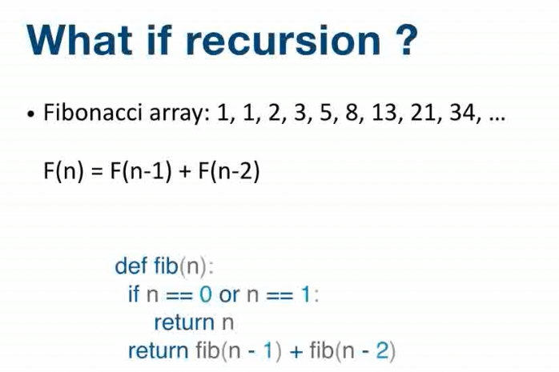

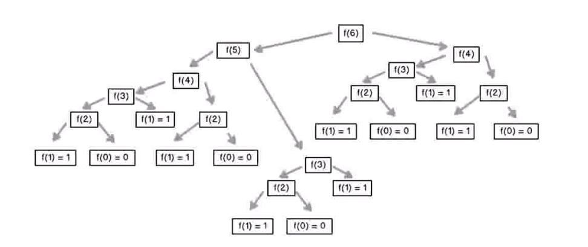


从递归推导时间复杂度：主定律([Master Theorem](https://en.wikipedia.org/wiki/Master_theorem_(analysis_of_algorithms)))   


## P6-7 数组和链表及练习

#### 数组 

内存中连续。

查询：O(1)

插入和删除：O(n)

#### 链表

查询：O(n)

插入和删除：O(1)

指针。

#### Practice

1. https://leetcode.com/problems/reverse-linked-list/ 
2. https://leetcode.com/problems/swap-nodes-in-pairs
3. https://leetcode.com/problems/linked-list-cycle
4. https://leetcode.com/problems/linked-list-cycle-ii
5. https://leetcode.com/problems/reverse-nodes-in-k-group


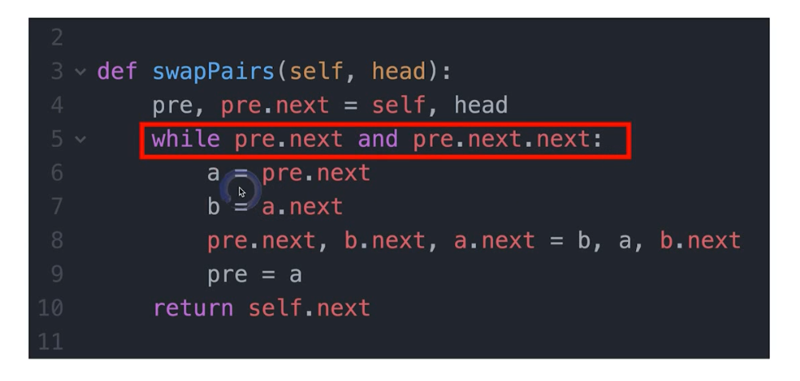

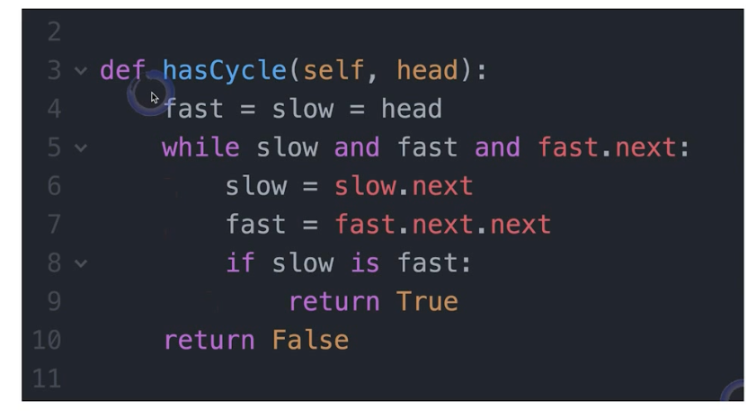


## P8-10 堆栈和队列(Stack and Queue) 

#### 堆栈 Stack: FILO 先入后出

- Array or linked list

#### 队列 Queue: FIFO 先入先出

- Array or doubly linked list

不太可能要求实现。

push/pop/peek

#### Practice

1. https://leetcode.com/problems/valid-parentheses/ (括号匹配问题，用栈)

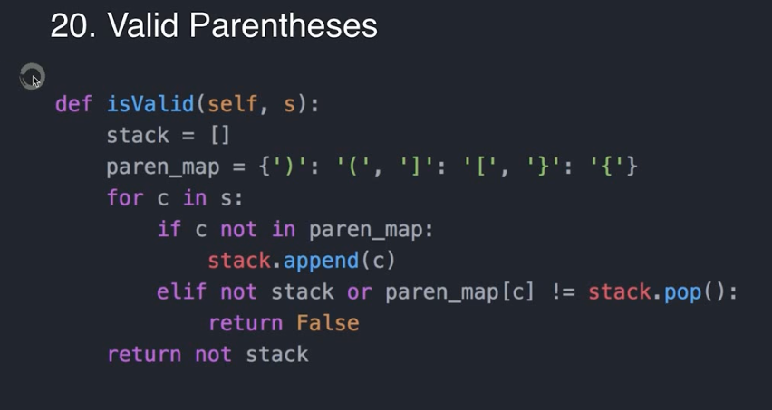

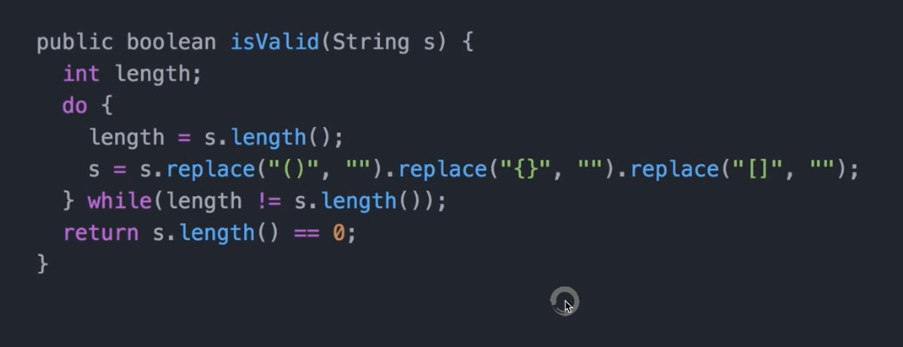

堆栈互相实现：

2. https://leetcode.com/problems/implement-queue-using-stacks/

3. https://leetcode.com/problems/implement-stack-using-queues/


## P11-13 Priority Queue: 优先队列

实现机制：

1. [Heap  (Binary, Binomial, Fibonacci)](https://en.wikipedia.org/wiki/Heap_(data_structure)) 

2. Binary Search Tree

#### 堆 Heap

堆这种数据结构的应用场景非常多，最经典的莫过于堆排序了。堆排序是一种原地的、时间复杂度为 O(nlogn) 的排序算法。[Python标准库模块之heapq](https://www.jianshu.com/p/801318c77ab5)

常见操作：

- **heapify** – This function converts a regular list to a heap. In the resulting heap the smallest element gets pushed to the index position 0. But rest of the data elements are not necessarily sorted.
- **heappush** – This function adds an element to the heap without altering the current heap.
- **heappop** – This function returns the smallest data element from the heap.
- **heapreplace** – This function replaces the smallest data element with a new value supplied in the function.

```python
import heapq
H = [21,1,45,78,3,5]
# Use heapify to rearrange the elements
heapq.heapify(H)
print(H)
# [1, 3, 5, 78, 21, 45]
##########################################
import heapq
H = [21,1,45,78,3,5]
# Covert to a heap
heapq.heapify(H)
print(H)
# Add element
heapq.heappush(H,8)
print(H)
"""
[1, 3, 5, 78, 21, 45]
[1, 3, 5, 78, 21, 45, 8]
"""
##########################################
import heapq
H = [21,1,45,78,3,5]
# Create the heap
heapq.heapify(H)
print(H)
# Remove element from the heap
heapq.heappop(H)
print(H)
"""
[1, 3, 5, 78, 21, 45]
[3, 21, 5, 78, 45]
"""
##########################################
import heapq
H = [21,1,45,78,3,5]
# Create the heap
heapq.heapify(H)
print(H)
# Replace an element
heapq.heapreplace(H,6)
print(H)
"""
[1, 3, 5, 78, 21, 45]
[3, 6, 5, 78, 21, 45]
"""
```

堆是一种特殊的树。

- 堆是一个完全二叉树；(完全二叉树要求，除了最后一层，其他层的节点个数都是满的，最后一层的节点都靠左排列。)

- 堆中每一个节点的值都必须大于等于（或小于等于）其子树中每个节点的值。

第一点，堆必须是一个完全二叉树。完全二叉树要求，除了最后一层，其他层的节点个数都是满的，最后一层的节点都靠左排列。

第二点，堆中的每个节点的值必须大于等于（或者小于等于）其子树中每个节点的值。也即：堆中每个节点的值都大于等于（或者小于等于）其左右子节点的值。

每个节点的值都大于等于子树中每个节点值的堆，叫作“大顶堆”，Max Heap。

每个节点的值都小于等于子树中每个节点值的堆，叫作“小顶堆”，Mini Heap。

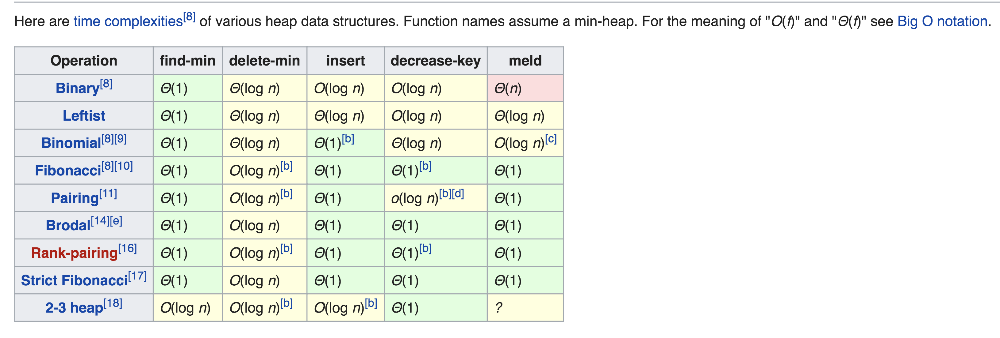

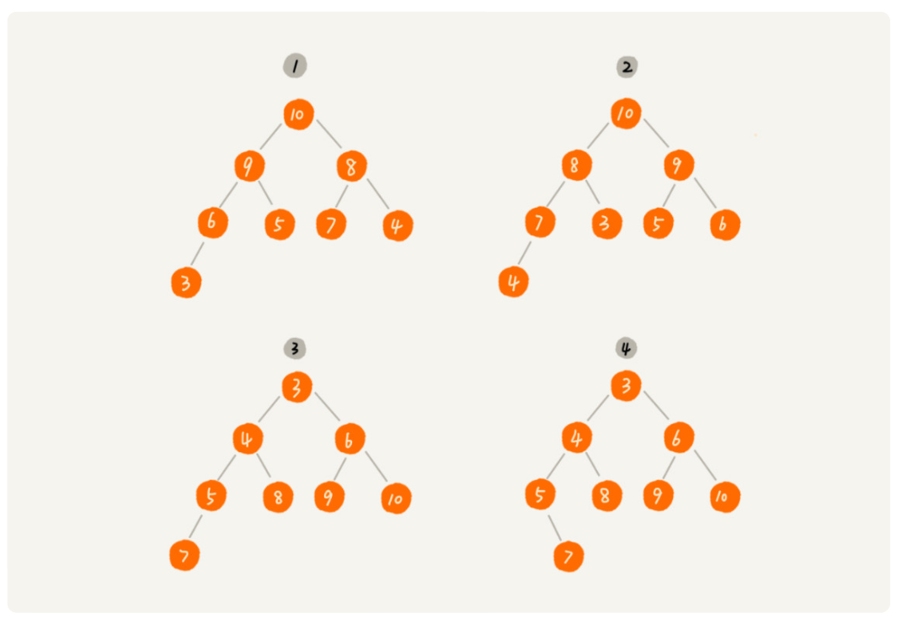

其中第 1 个和第 2 个是大顶堆，第 3 个是小顶堆，第 4 个不是堆。除此之外，从图中还可以看出来，对于同一组数据，我们可以构建多种不同形态的堆。

#### Practice

[[OK] kth-largest-element-in-a-stream](https://leetcode.com/problems/kth-largest-element-in-a-stream)：最小堆

[[OK] sliding-window-maximum](https://leetcode.com/problems/sliding-window-maximum)：双端队列

deque, 全名double-ended queue, 即双端队列。是一种具有队列和栈的性质的数据结构。双端队列中的元素可以从两端弹出，其限定插入和删除操作在表的两端进行。


## P14-17 映射(Map)和集合(Set)

经常用来做查询计数。


哈希函数。

Hash Collisions 哈希碰撞：碰到重复的情况：在重复的位置再建一个链表进行存储（拉链法）


实现方式： 

- HashMap vs TreeMap

- HashSet vs TreeSet

(Hash table vs binary-search-tree)

Hash table： 无序，查询：O(1)

binary-search-tree： 有序，查询：O(logN)


如果对速度有要求，对顺序没要求就用Hash；如果对速度无要求，但对顺序有要求，则用Tree。 

不同语言中的实现：

Python: `dict` (hashmap) |  `set`(hashset)

Java: `HashMap`, `TreeMap` | `HashSet`, `TreeSet` 

C++: `std::unordered_map`, `std::map` |  `std::unordered_set`, `std::set`


#### practice

[242. Valid Anagram](https://leetcode.com/problems/valid-anagram/)

[1. Two Sum](https://leetcode.com/problems/two-sum/)

[15. 3Sum](https://leetcode.com/problems/3sum/)

[18. 4Sum](https://leetcode.com/problems/4sum/)


## P18-21 树

树，二叉树，图

链表是特殊的树，图是特殊的树

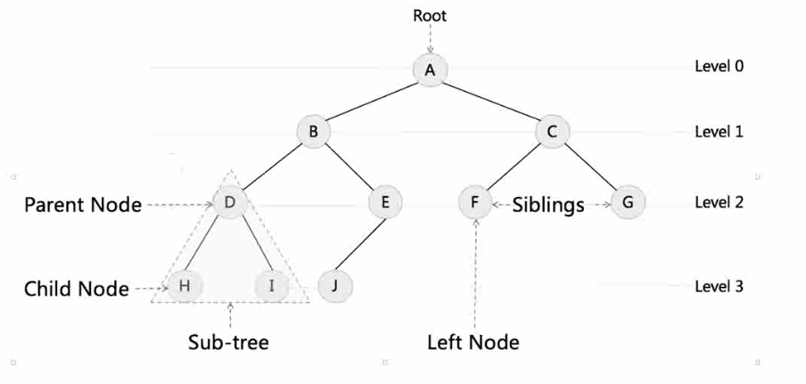

树的高度（Height）、深度（Depth）、层（Level）：

* 节点的高度：节点到叶子节点的最长路径(边数)；

* 节点的深度：根节点到这个节点所经历的边的个数；

* 节点的层数：节点的深度+1

* 树的高度：根节点的高度


树的实现：

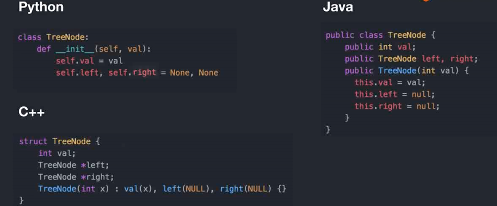


**满二叉树** ：叶子节点全都在最底层，除了叶子节点之外，每个节点都有左右两个子节点。

**完全二叉树**：叶子节点都在最底下两层，最后一层的叶子节点都靠左排列，并且除了最后一层，其他层的节点个数都要达到最大。


#### 二叉树的遍历

二叉树的遍历分为三种：前序遍历、中序遍历和后序遍历，根据根的位置分类   。

- **前序遍历(Preorder Traversal )**：NLR（根左右），访问根结点的操作发生在遍历其左右子树之前。
- **中序遍历(Inorder Traversal)**：LNR（左根右），访问根结点的操作发生在遍历其左右子树之中（间）。
- **后序遍历(Postorder Traversal)**：LRN（左右根），访问根结点的操作发生在遍历其左右子树之后。


Pseudocode：

```java
void preOrder(Node* root) {
  if (root == null) return;
  print root // 此处为伪代码，表示打印 root 节点
  preOrder(root->left);
  preOrder(root->right);
}

void inOrder(Node* root) {
  if (root == null) return;
  inOrder(root->left);
  print root // 此处为伪代码，表示打印 root 节点
  inOrder(root->right);
}

void postOrder(Node* root) {
  if (root == null) return;
  postOrder(root->left);
  postOrder(root->right);
  print root // 此处为伪代码，表示打印 root 节点
}
```


```python
class TreeTraverse:
    def __init__(self):
        self.traverse_path_pre = []
        self.traverse_path_in = []
        self.traverse_path_post = []
 
    def preorder(self,root):
        if root:
            self.traverse_path_pre.append(root.val)
            self.preorder(root.left)
            self.preorder(root.right)
        return self.traverse_path_pre
      
    def inorder(self,root):
        if root:
            self.inorder(root.left)
            self.traverse_path_in.append(root.val)
            self.inorder(root.right)
        return self.traverse_path_in
      
    def postorder(self,root):
        if root:
            self.postorder(root.left)
            self.postorder(root.right)
            self.traverse_path_post.append(root.val)
        return self.traverse_path_post
```


#### 二叉搜索树：中序遍历是升序的！

中序遍历二叉查找树，可以输出有序的数据序列，时间复杂度是 O(n)，非常高效。因此，二叉查找树也叫作二叉排序树。

**中序遍历(Inorder Traversal)**：LNR（左根右），访问根结点的操作发生在遍历其左右子树之中（间）。

binary search tree, ordered/sorted binary tree

让查找更加高效，比链表更加高效了。

<b>左子树</b>上所有的节点的值均小于它的根节点的值；

<b>右子树</b>上所有的节点的值均大于它的根节点的值；

Recursively, 左右子树也分别是二叉搜索树。下面这些都是二叉搜索树：

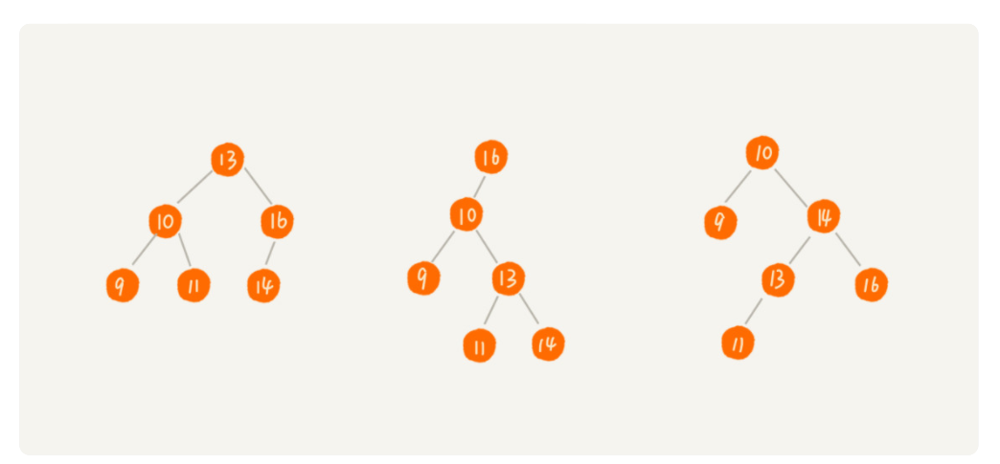

#### Practice

[98. Validate Binary Search Tree](https://leetcode.com/problems/validate-binary-search-tree/)

[235. Lowest Common Ancestor of a Binary Search Tree](https://leetcode.com/problems/lowest-common-ancestor-of-a-binary-search-tree/)

1. 路径交点，但是需要父节点，类似链表了。可以从父节点去分别找两个节点，确定路径。
2. 递归

[236. Lowest Common Ancestor of a Binary Tree](https://leetcode.com/problems/lowest-common-ancestor-of-a-binary-tree/)


## P22-24 递归和分治


```python
# 递归模板：
def recursion(level, param1, param2, ...):
  
    if level > MAX_LEVEL:
        # ...
        return

    process_data(level, data, ...)
        
    self.recursion(level+1, p1, ...)
    
    reverse_state(level)
      
```


比如：斐波那契数列：

```python
def fib(n):
    if n <= 1:
        return n
    return fib(nn-1)+fib(nn-2)
```

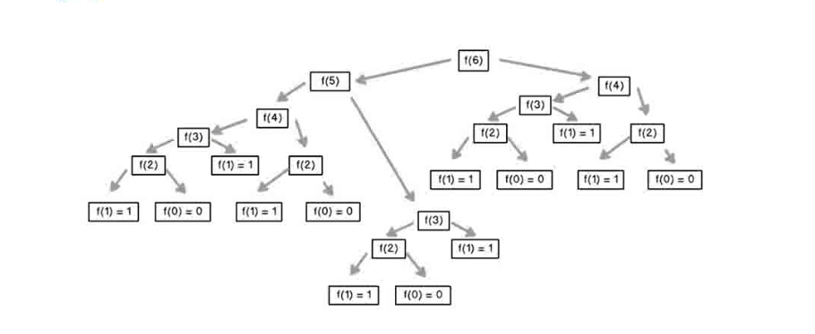

递归不一定是最优，中间可能有很多重复的操作。


#### Divide&Conquer

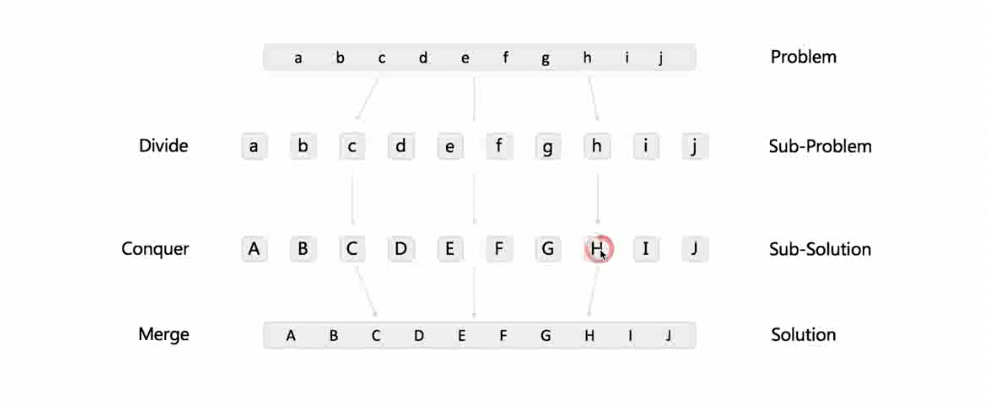


```python
# 分治模板：
def divide_conquer(self,problem, param1,param2,...):
    if problem:
        print_result
        return
    
    data = prepare_data(problem)
    subproblems = split_problem(problem,data)

    sub1 = self.divide_conquer(subproblems[0],p1, ...)
    sub2 = self.divide_conquer(subproblems[1],p1, ...)
    sub3 = self.divide_conquer(subproblems[2],p1, ...)
    # ......

    result = process_result(sub1,sub2,sub3,...)
```


#### Practice

[50. Pow(x, n)](https://leetcode.com/problems/powx-n/)

[169. Majority Element](https://leetcode.com/problems/majority-element/)


## P25-26 贪心算法

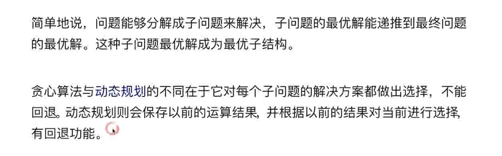

简单地说，问题能够分解成子问题来解决，子问题的最优解能递推到最终问题的最优解。这种子问题最优解成为最优子结构。

贪心算法与动态规划的不同在于它对每个子问题的解决方案都做出选择，不能回退。动态规划则会保存以前的运算结果并根据以前的结果对当前进行选择有回退功能。

#### Practice

[122. Best Time to Buy and Sell Stock II](https://leetcode.com/problems/best-time-to-buy-and-sell-stock-ii/)

1.深度优先搜索 2.贪心算法 3.动态规划


## P27-30 深度和广度优先搜索


#### BFS(广度优先搜索)

广度优先搜索（Breadth-First-Search），我们平常都把简称为 BFS。直观地讲，它其实就是一种“地毯式”层层推进的搜索策略，即先查找离起始顶点最近的，然后是次近的，依次往外搜索。

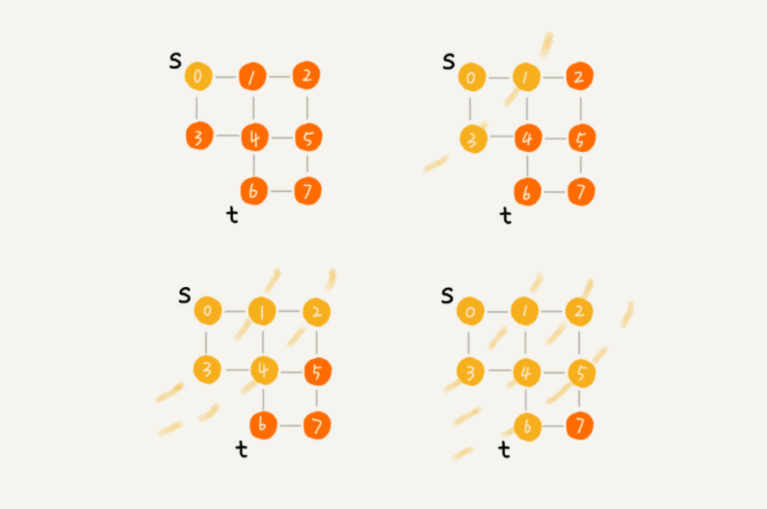

```python
def bfs(graph,s,e):
  q=[]
  q.append([s])
  visited.add(s)
  while q:
    node = q.pop()
    visited.add(node) # 树的话，不需要； 图的话，不要忘记这个
    process(node)
    nodes = generate_related_nodes(node)
    q.push(nodes)
  # ...
```

#### DFS(深度优先搜索)

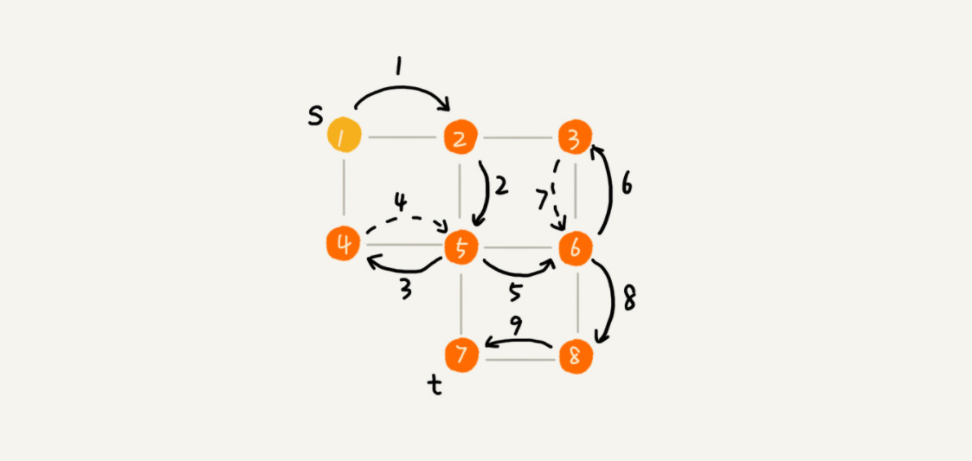


```python
visited = set()
def dfs(node,visited):
  visited.add(node)
  # process current node here
  #...
  for next in node.children():
    if not next in visited:
      dfs(next,visited)
```


#### Practice

[102. Binary Tree Level Order Traversal](https://leetcode.com/problems/binary-tree-level-order-traversal/)

BFS、DFS (记住层数)

[104. Maximum Depth of Binary Tree](https://leetcode.com/problems/maximum-depth-of-binary-tree/)

BFS、DFS (记住层数)

[111. Minimum Depth of Binary Tree](https://leetcode.com/problems/minimum-depth-of-binary-tree/)

思路类似于，104题，最大深度。只是要注意左右子树为空的情况。易出bug。


## REFERENCE

[LeetCode](https://leetcode.com/problemset/all/)

[Know Thy Complexities](http://www.bigocheatsheet.com/)

