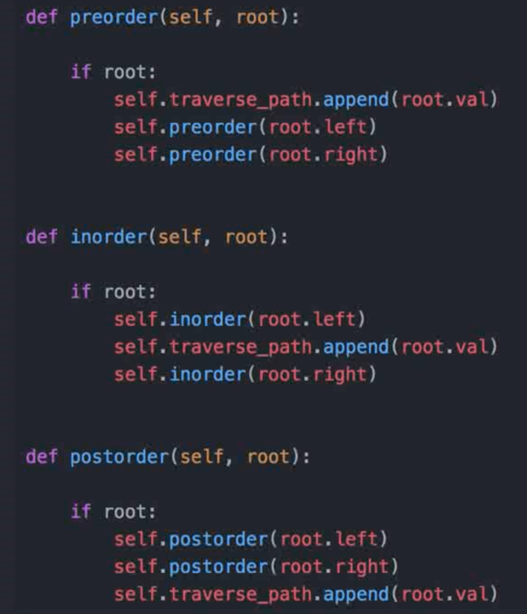

<!--more-->

优先级队列！

刻意练习！练习缺点，弱点的地方。跳出舒适区。

机会总是留给有准备的人！

## P3

常用数据结构：


 


[heapq](https://www.jianshu.com/p/801318c77ab5)

## 堆

堆是一种特殊的树。

- 堆是一个完全二叉树；(完全二叉树要求，除了最后一层，其他层的节点个数都是满的，最后一层的节点都靠左排列。)

- 堆中每一个节点的值都必须大于等于（或小于等于）其子树中每个节点的值。


## 快速排序


```python
def quick_sort(lst):
    if not lst:
        return []
    if len(lst)<2:
        return lst
    pivot = lst[0]
    left = quick_sort([x for x in lst[1: ] if x < pivot])
    right = quick_sort([x for x in lst[1: ] if x >= pivot])
    return left + [pivot] + right
```


## P4 算法复杂度


#### 时间和空间复杂度：


递归，斐波拉契数列，时间复杂度：指数复杂度，2的N次方


从递归推导时间复杂度：主定律([Master Theorem](https://en.wikipedia.org/wiki/Master_theorem_(analysis_of_algorithms)))   


## P5 LeetCode

```python
class Solution:
  def twoSum(self,nums,target):
    hash_map = dict()
    for i,x in enumerate(nums):
      if target-x in hash_map:
        return [i,hash_map[target-x]]
      hash_map[x]=i
```

## P6-7 数组和链表及练习

#### 数组 

内存中连续。

查询：O(1)

插入和删除：O(n)

#### 链表

查询：O(n)

插入和删除：O(1)

指针。

#### Practice

1. https://leetcode.com/problems/reverse-linked-list/ 
2. https://leetcode.com/problems/swap-nodes-in-pairs
3. https://leetcode.com/problems/linked-list-cycle
4. https://leetcode.com/problems/linked-list-cycle-ii
5. https://leetcode.com/problems/reverse-nodes-in-k-group


## P8-9 堆栈和队列(Stack and Queue) 

#### Stack: FILO 先入后出

- Array or linked list

#### Queue: FIFO 先入先出

- Array or doubly linked list

不太可能要求实现。


push/pop/peek


deque, 全名double-ended queue, 即双端队列。是一种具有队列和栈的性质的数据结构。双端队列中的元素可以从两端弹出，其限定插入和删除操作在表的两端进行。

##### Practice

1. https://leetcode.com/problems/valid-parentheses/
2. https://leetcode.com/problems/implement-queue-using-stacks/
3. https://leetcode.com/problems/implement-stack-using-queues/


#### Priority Queue: 优先队列

实现机制：1. [Heap  (Binary, Binomial, Fibonacci)](https://en.wikipedia.org/wiki/Heap_(data_structure)) 2. Binary Search Tree

https://leetcode.com/problems/kth-largest-element-in-a-stream

https://leetcode.com/problems/sliding-window-maximum


## 映射(Map)和集合(Set)


哈希函数

Hash Collisions 哈希碰撞：碰到重复的情况：在重复的位置再建一个链表进行存储


 HashMap vs TreeMap

 HashSet vs TreeSet

(Hashtable vs binary-search-tree)

如果对速度有要求，对顺序没要求就用Hash；如果对速度无要求，但对顺序有要求，则用Tree。 

不同语言中的实现：

Python: `dict` (hashmap) |  `set`(hashset)

Java: `HashMap`, `TreeMap` | `HashSet`, `TreeSet` 

C++: `std::unordered_map`, `std::map` |  `std::unordered_set`, `std::set`


## 二叉树遍历




## 递归和分治


## 贪心算法


## BFS(广度优先搜索)

## DFS(深度优先搜索)


DFS代码：递归写法：

```python
visited = set()
def dfs(node,visited):
    visited.add(node)
    # process current node here
    # ...
    for next_node in node.children():
        if not next_node in visited:
            dfs(next_node, visited)
```

DFS代码：非递归写法：


## REFERENCE

[LeetCode](https://leetcode.com/problemset/all/)

[Know Thy Complexities](http://www.bigocheatsheet.com/)

